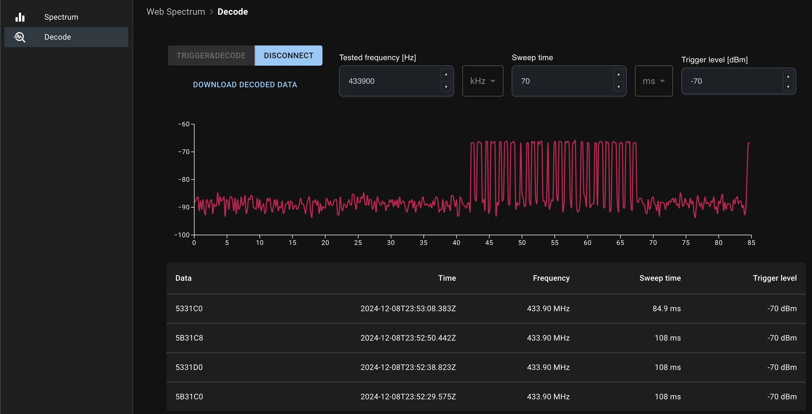

# web-spectrum
Web app for spectrum analyzers.

Visit [meshuga.github.io/web-spectrum](https://meshuga.github.io/web-spectrum/) to access the app.

The application has two features:
* Spectrum analyzer
* Data decoding

Supported devices:
* tinySA Ultra

Supported environments:
* Chrome
* Edge
* Opera

See more: [caniuse.com/web-serial](https://caniuse.com/web-serial)

## Spectrum analyzer

Spectrum analyzer allows for showing available spectrum for requested frequencies.

## Data decoding

Data decode sets a trigger and upon detection of a signal, the device captures it for decoding purposes.

## References

YT videos with explanations and tests:
* [Web (r)evolution in lab electronics? Building a Web Spectrum Analyzer for TinySA Ultra](https://www.youtube.com/watch?v=XeK0TL0F8DI&t=7s&ab_channel=PatrickonEngineering)
* [Signal decoding with TinySA Ultra](https://www.youtube.com/watch?v=bqgmftWSKPc&t=9s&ab_channel=PatrickonEngineering)

## Development

In the project directory, you can run:

### `npm start`

Runs the app in the development mode.\
Open [http://localhost:3005](http://localhost:3005) to view it in your browser.

The page will reload when you make changes.\
You may also see any lint errors in the console.

### `npm test`

Launches the test runner in the interactive watch mode.\
See the section about [running tests](https://facebook.github.io/create-react-app/docs/running-tests) for more information.

### `npm run build`

Builds the app for production to the `build` folder.\
It correctly bundles React in production mode and optimizes the build for the best performance.

The build is minified and the filenames include the hashes.\
Your app is ready to be deployed!

See the section about [deployment](https://facebook.github.io/create-react-app/docs/deployment) for more information.
